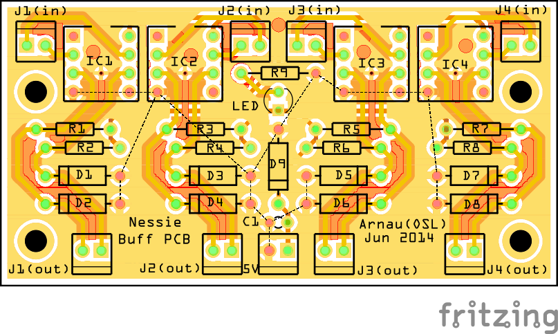

OSL I2C Buffer Board
====================

The __OSL I2C Buffer Board__ is a small 2-layer pcb design for extending the range of existing I2C buses by using a common I2C buffer chip. This board should be used together with a sister one, providing thus buffering up to 4 different I2C bus. Alternatively it can be used with the __[OSL Buff Board](https://github.com/decabyte/osl_buff_board)__. in case a more complex configuration is needed, for instance, in the case of motor control.

The following layout ([fritzing file](buff_board_final.fzz)) is taken as reference while the I2C buffer chip can be choosen among a list of compatible one. In the reference design the NXP P82B715PN bus extender chip is used.

The main features of this board are the use of protection diodes on the buffered output lines and the input power line. This because the board was intended to be used in harsh environments like robotics applications. This board has been designed together with Arnau Puig Mensa.

### Main Components

* 4 x NXP P82B715PN I2C bus extender
* 4 x SA5.0A 5.0V TVS Diode

For a more detailed list look at [the bill of materials](docs/buff_board_final_bom.html) in the [docs](docs) dir.

## References

* [NXP P82B715PN](http://www.nxp.com/products/interface_and_connectivity/i2c/i2c_bus_repeaters_hubs_extenders/P82B715PN.html)
* [Arduino WireLibrary Details](http://playground.arduino.cc/Main/WireLibraryDetailedReference)

## LICENSE - "MIT License"

Copyright (c) 2013-2014 Valerio De Carolis, http://decabyte.it

Permission is hereby granted, free of charge, to any person
obtaining a copy of this software and associated documentation
files (the "Software"), to deal in the Software without
restriction, including without limitation the rights to use,
copy, modify, merge, publish, distribute, sublicense, and/or sell
copies of the Software, and to permit persons to whom the
Software is furnished to do so, subject to the following
conditions:

The above copyright notice and this permission notice shall be
included in all copies or substantial portions of the Software.

THE SOFTWARE IS PROVIDED "AS IS", WITHOUT WARRANTY OF ANY KIND,
EXPRESS OR IMPLIED, INCLUDING BUT NOT LIMITED TO THE WARRANTIES
OF MERCHANTABILITY, FITNESS FOR A PARTICULAR PURPOSE AND
NONINFRINGEMENT. IN NO EVENT SHALL THE AUTHORS OR COPYRIGHT
HOLDERS BE LIABLE FOR ANY CLAIM, DAMAGES OR OTHER LIABILITY,
WHETHER IN AN ACTION OF CONTRACT, TORT OR OTHERWISE, ARISING
FROM, OUT OF OR IN CONNECTION WITH THE SOFTWARE OR THE USE OR
OTHER DEALINGS IN THE SOFTWARE.
